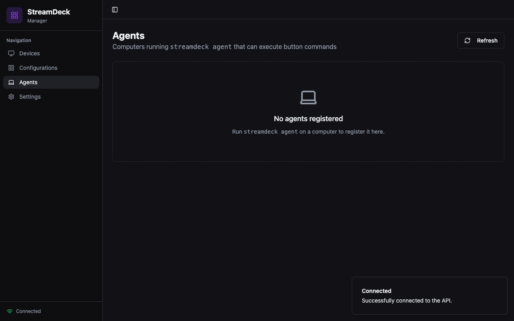
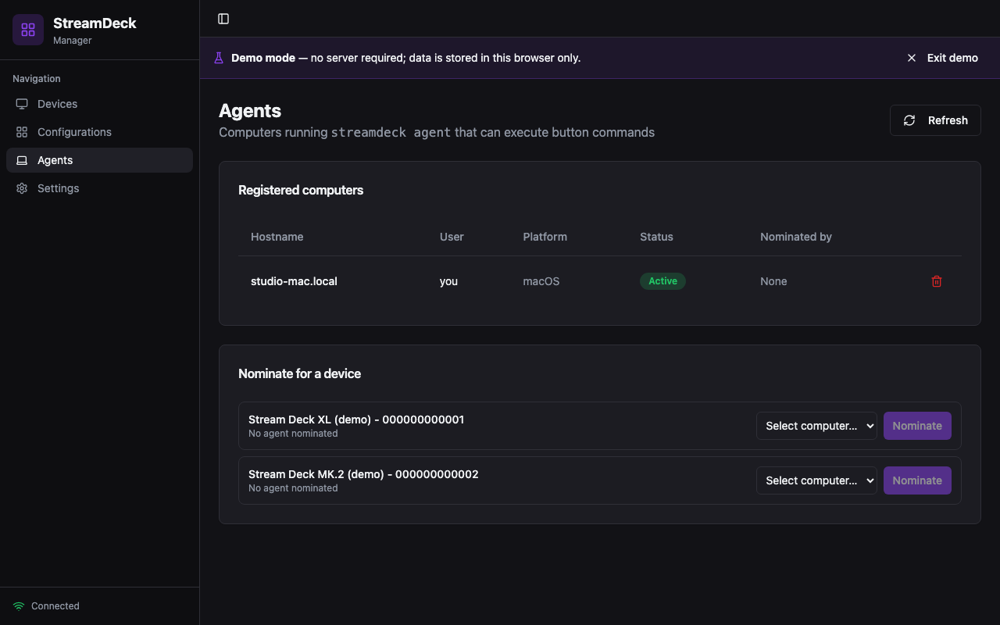
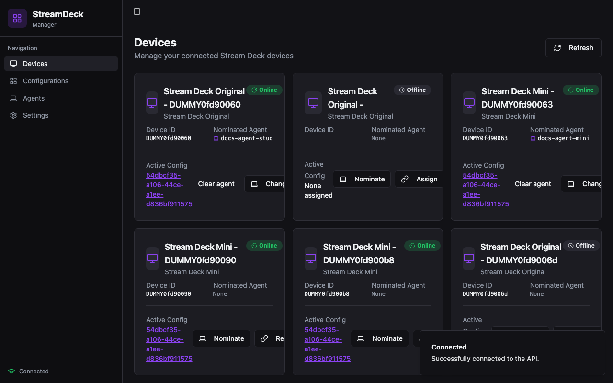
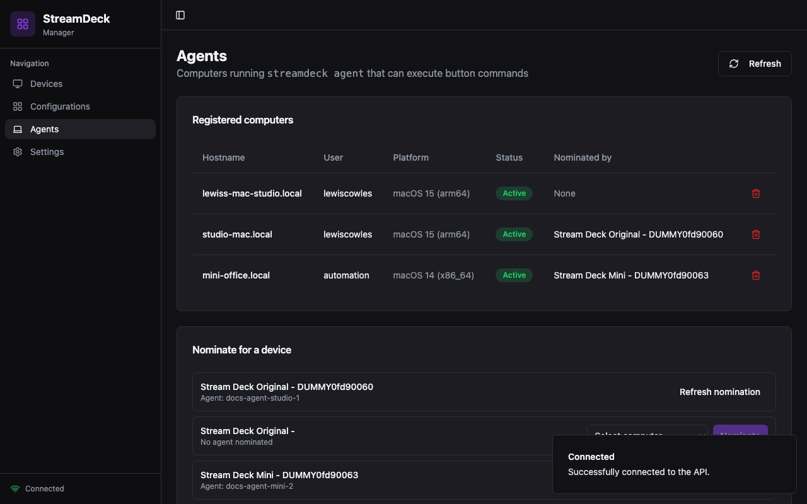
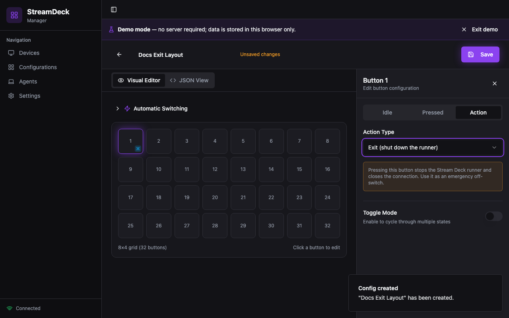
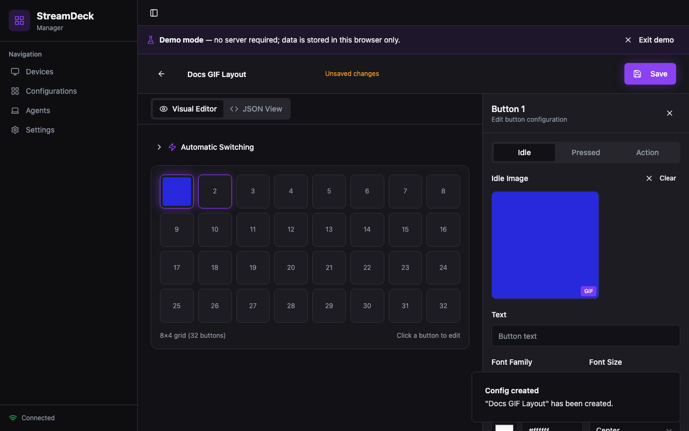

# Frontend ↔ Backend Feature Parity

Every feature on one side must be supported on the other. This document is the
contract; `tests/test_parity.py` is its executable form. If a parity test
fails, the two surfaces have drifted — fix the code or update both sides
deliberately (and this table) in the same change.

Status: **2026-09-19** — all rows implemented and regression-tested.

## Parity rules (each enforced by a test in `tests/test_parity.py`)

| # | Rule | Test |
|---|------|------|
| P1 | Template variables the UI inserts (`{{button_index}}`, `{{device_id}}`, `{{toggle_state}}`, `{{config_name}}`, `{{timestamp}}`, `{{date}}`, `{{time}}`) are expanded by the agent before execution — in `executable`, `arguments`, `cwd`, and `env`. | `test_expand_template_vars_*`, `test_execute_expands_variables_with_context`, `test_execute_still_expands_without_context`, `test_runner_dispatch_expands_button_context`, `test_toggle_state_context_expands_in_action`; E2E: parity-demo "action editor inserts template variables into the arguments field" |
| P2 | Font config stored by the UI (`font.family/size/color/weight/position`) is honored by the runner when drawing labels. Defaults = original port (Roboto 14, white, bottom) so old configs render identically. | `test_label_style_*`, `test_font_config_used_in_rendering`, `test_font_position_top_and_bottom_anchors`, `test_font_family_resolves_to_existing_font`, `test_font_style_flows_into_rendered_label`; E2E: parity-demo "font config edits persist through save + reload" |
| P3 | The `exit` action is configurable from the UI (ActionEditor "Exit" type) and means the bare-string `exit` the runner dispatches on. | `test_exit_action_contract_is_bare_string` |
| P4 | Deleting a config clears `current_config_id` on devices (no dangling assignments in the dashboard). | `test_config_delete_clears_device_assignment` |
| P5 | CORS allows the UI origins (8080 demo, 8081 full-stack E2E). | `test_cors_preflight_from_ui_port*` |
| P6 | Agent model dialect is snake_case (`last_seen`) — no camelCase aliases; frontend reads both spellings elsewhere. | `test_agent_dialect_is_snake_case` |
| P7 | `GET /device/{id}/config` returns camelCase device fields (`currentConfigId`, `activeAgentId`) like every other endpoint. | `test_device_config_endpoint_dialect` |
| P8 | Action `timeout` is configurable in the UI and honored by the agent executor. | `test_command_action_timeout_env_dialect`, wire hop in `test_agent_roundtrip` (timeout/env survive queue→poll); E2E: parity-demo "timeout and env vars round-trip through save + reload", parity-fullstack "command action with template variables round-trips through the real API" |
| P9 | All 8 vendored deck types render a grid in the UI, in both name dialects (kebab ids + human names like "Stream Deck XL"), with a safe fallback for unknown types. | `deviceDimensions()` + `deviceTypeLabel()` helpers; exercised by E2E |
| P10 | Animated and static images the UI embeds as `data:` URIs (`FileReader.readAsDataURL`) are rendered by the runner through `render_key_image`, which decodes each animation frame once into an `itertools.cycle` cached in `persistent_images` keyed by the full source string — the same source on multiple buttons shares one decode and one cycle. The 30fps `animate` loop (`FRAMES_PER_SECOND`) pushes frames per button via `persistent_image_buttons`. | `test_animated_data_uri_from_frontend_pipeline_decodes_to_frames`, `test_animated_data_uri_is_shared_between_buttons`; E2E `parity-demo`/`parity-fullstack` GIF specs |

## Backend-only surface, intentionally device/agent-facing (no UI by design)

- `GET /agents/{id}/actions`, `POST /agents/{id}/actions/{id}/result`,
  `POST /agent-actions` — the wire protocol used by `streamdeck agent` and the
  runner. Covered by `tests/test_api.py::test_agent_roundtrip`.
- `GET /device/{id}/config` — consumed by the runner to load the assigned
  config; the UI now also exposes it via `devicesApi.getAssignedConfig`.
- `GET /devices` upserting newly seen decks — device-side side effect.

## Backend quirks the frontend tolerates (do not "fix" silently)

- Device `type` arrives as a human name (`"Stream Deck XL"`); configs store
  kebab ids (`"stream-deck-xl"`). The runner matches both; the UI maps both.
- `PUT /config/{id}` replaces the whole row — partial bodies 422. The UI
  always sends the full config; `configsApi.update` is typed accordingly.
- The `Agent` model has no aliases (snake_case wire dialect) while every
  other model uses camelCase aliases.
- `DELETE /config/{id}` returns the deleted row (200), not 204.

## Demo mode (`frontend/src/lib/demo-api.ts`)

Demo mirrors the REST surface in `lib/api.ts` and follows the same semantics:

- Same routes: devices, assign, get-assigned-config, nominate/clear agent,
  configs CRUD, agents list/delete.
- Same dialect: devices carry both camelCase and snake_case fields; agents are
  snake_case (`active`, `last_seen` — no `connected`).
- Same semantics: `create` server-generates the id and does **not** invent
  `createdAt`/`updatedAt` (no such columns on the backend); `update` replaces
  name/deviceType/buttons like the real PUT; unknown ids throw not-found.
- Demo device seeds use the human device-type names the real API returns.

## Historical gaps closed by this parity pass (kept for context)

1. Template variables advertised by the UI were never expanded by the backend
   → now expanded in `agent.execute` (recursive, env/cwd included) and at
   dispatch time in the runner (button/device/toggle/config context injected).
2. Font config was stored but ignored at render time → now honored
   (family→resolved font file, size, color, position top/center/bottom).
3. Agents had zero UI → new Agents page, nomination dialog + clear-agent
   control on DeviceCard, sidebar entry, `agentsApi` client, demo mock.
4. `exit` action was unconfigurable in the UI → ActionEditor "Exit" type.
5. Device type dialects broke labels (undefined subtitle) → both dialects
   mapped; dimensions for all 8 deck types incl. Pedal/Studio/Neo; fallback.
6. `openapi.yaml` was a pre-port fossil → rewritten to the actual API
   (`docs/openapi.yaml`).
7. Config deletion left dangling device assignments → cleared on delete.
8. CORS only allowed 8080 → 8081 (full-stack E2E UI port) added.
9. Phantom fields removed: `Device.serial` (id *is* the serial),
   `createdAt`/`updatedAt` on configs (no backend columns).
10. Demo `Agent` shape had drifted (`connected` vs `active`/`last_seen`) →
    aligned with the backend model.
11. Demo `update` merged (PATCH-like) while the real API replaces → aligned.
12. `/device/{id}/config` returned snake_case while everything else is
    camelCase → serialized by alias; readers tolerate both.

## Screenshots

Captured during the parity pass (see `docs/screenshots/`):

| Screenshot | What it shows |
|------------|---------------|
|  | New **Agents** page (demo mode) before any agent is registered — empty state with the `streamdeck agent` hint. |
|  | The nomination flow: agent registered, "Nominated by" shows the assigning device, and a second deck offers the per-device select + **Nominate** button. |
|  | Real API (dummy transport): device cards render human-name types ("Stream Deck Original", "Stream Deck Mini") with Device ID / Nominated Agent fields and Nominate / Assign actions. |
|  | The Agents page talking to the live API — registered computer (hostname / user / platform / status) and per-device nomination for every dummy deck. |
|  | The config editor **Action** tab offering "Exit (shut down the runner)" alongside "Command" — the P3 surface. |
|  | Animated-GIF upload (P10): preview thumbnail on the grid button, **GIF** badge on the idle image, unsaved-changes state — verified by E2E and by the runner's frame-decode tests. |