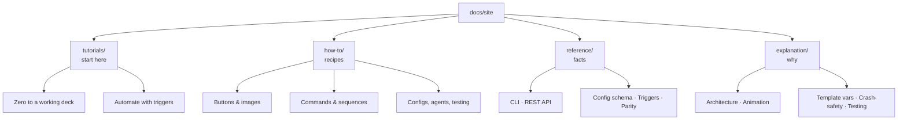

# Stream Deck monorepo — documentation

This site is organized by [Diátaxis](https://diataxis.fr/) — documentation is
split by *what you need*, not by *which component* it belongs to. Pick the
page that matches your situation:

| I want to… | Go to | Type |
| --- | --- | --- |
| learn the stack by building something real, start to finish | [Tutorials](tutorials/index.md) | **learning-oriented** |
| get a specific task done (upload a GIF, run a sequence, nominate an agent…) | [How-to guides](how-to/index.md) | **task-oriented** |
| look up a CLI flag, REST endpoint, config key or parity rule | [Reference](reference/index.md) | **information-oriented** |
| understand *why* it is built this way (architecture, animation pipeline, crash-safety, testing philosophy) | [Explanation](explanation/index.md) | **understanding-oriented** |

## The map

### Tutorials — learning-oriented

One path, start to finish, with everything you need along the way:

1. **[From zero to a working deck](tutorials/zero-to-deck.md)** — install,
   start the API + UI, build a config in the browser, assign it to a device,
   run the device runner, and see your buttons render on (emulated) hardware.
2. **[Automate with triggers](tutorials/triggers.md)** — make configs switch
   themselves when an app comes to the front or your Wi-Fi changes.

### How-to guides — task-oriented

Each guide solves one concrete problem, with numbered steps and verification.

*Working with buttons*

- [Upload an animated GIF button](how-to/animated-gif-button.md)
- [Pause and resume an animation](how-to/pause-animation.md)

*Running commands*

- [Run commands attached vs detached](how-to/attached-detached-commands.md)
- [Build a multi-step sequence](how-to/multi-step-sequences.md)

*Organizing configs*

- [Switch configs from a button](how-to/switch-config-button.md)
- [Set up automatic switching with triggers](how-to/automatic-switching-triggers.md)

*Computers and agents*

- [Nominate an agent computer](how-to/nominate-agents.md)

*Real hardware*

- [Test a real Stream Deck](how-to/real-hardware.md)

*Developer workflows*

- [Use shell completion and input autocomplete](how-to/completion.md)
- [Run the test suites](how-to/run-tests.md)

### Reference — information-oriented

Dry, complete, accurate. Nothing to learn here — just look it up.

- [CLI reference](reference/cli.md) — every command and option.
- [REST API reference](reference/api.md) — endpoints, dialect rules, status codes.
- [Config schema reference](reference/config-schema.md) — every key the runner reads.
- [Triggers block reference](reference/triggers.md) — the automatic-switching JSON.
- [Parity rules P1–P18](reference/parity.md) — the frontend ↔ backend contract.

### Explanation — understanding-oriented

- [Architecture overview](explanation/architecture.md) — who talks to what,
  the queue→poll→result lifecycle, and the JSON-column dialect rationale.
- [The animation pipeline](explanation/animation-pipeline.md) — data URI →
  decode-once → 30 fps loop, and the pause/play state machine.
- [Template variables](explanation/template-variables.md) — where `{{...}}`
  expands, with what context, and why it recurses.
- [Crash-safety design](explanation/crash-safety.md) — the catch-all layers
  that keep a bad image, bad action or dead probe from killing the stack.
- [Testing philosophy](explanation/testing-philosophy.md) — parity rules as
  tests, the red-green loop, mutation verification, and the builder→critic→judge
  round structure.
- [Vendored-core provenance](explanation/provenance.md) — what was ported from
  where, and the rule that keeps history honest.

## Where the source of truth lives

| Topic | Document |
| --- | --- |
| Development setup, everyday commands, env vars | [docs/dev.md](../dev.md) |
| The parity contract (executable: `tests/test_parity.py`) | [docs/parity.md](../parity.md) |
| Machine-readable API contract | [docs/openapi.yaml](../openapi.yaml) |
| Port history and vendored-core deltas | [PROVENANCE.md](../../PROVENANCE.md) |
| Round-by-round decision log | [docs/roadmap.md](../roadmap.md) |

Screenshots referenced throughout live in [docs/screenshots/](../screenshots/) —
e.g. the [full-stack dashboard](../screenshots/fullstack-dashboard.png) and the
[animated-GIF upload](../screenshots/upload-gif-badge.png).

## Conventions used in these pages

- CLI blocks are real commands (verified against `streamdeck --help`).
- UI walkthroughs name the exact buttons, tabs and placeholders you'll see.
- Where the UI is exercised by automated tests, the docs embed the matching
  Playwright snippet and name the spec file it came from.
- macOS-specific behavior (trigger probes, font resolution) is flagged where
  it applies — see [the trigger reference](reference/triggers.md) and
  [fonts in the config schema](reference/config-schema.md#font).