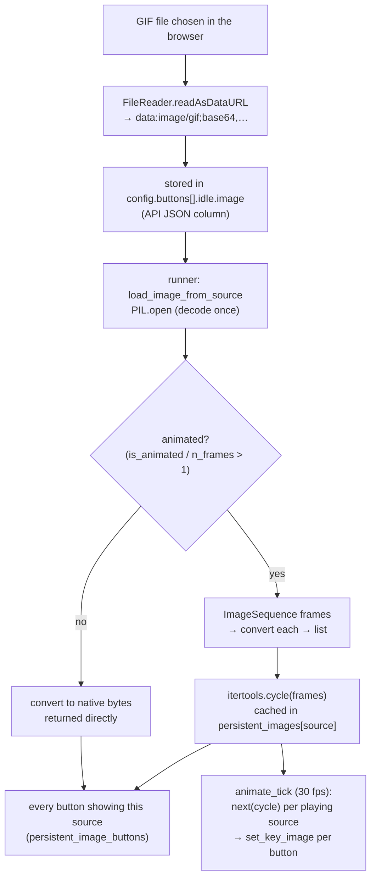
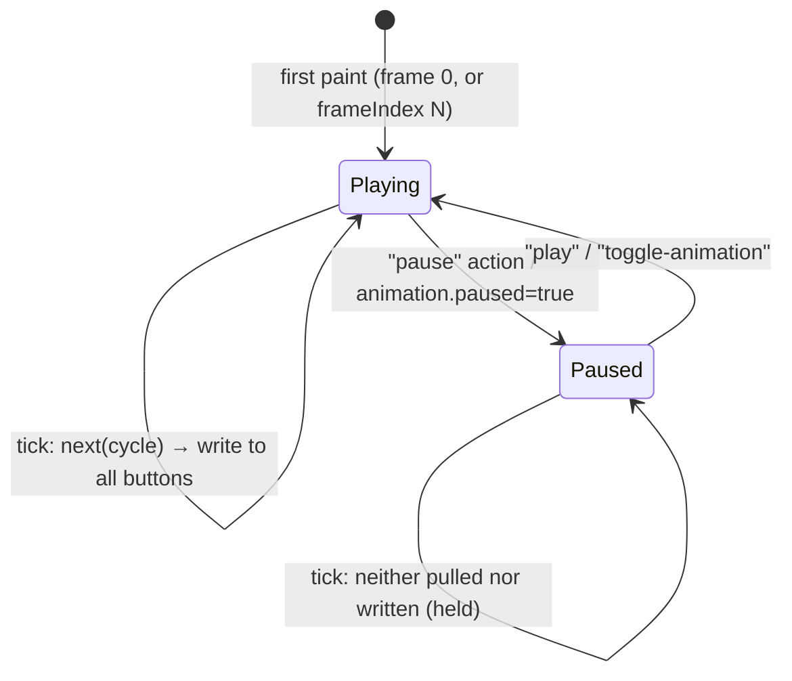

# The animation pipeline

How an animated GIF travels from a browser upload to 30 frames-per-second on
a Stream Deck key — and how pause/play works. Parity rule
[P10](../reference/parity.md) (shared decode) and
[P13](../reference/parity.md) (pause) pin the behavior.

## The pipeline end to end

### Stage by stage

1. **Data URI.** The UI embeds uploads as base64 data URIs
   (`FileReader.readAsDataURL`). The value rides inside the config JSON —
   the API stores it verbatim (schema-less column), and the runner decodes
   it with `PIL.Image.open(BytesIO(base64.b64decode(...)))`. HTTP URLs and
   local paths are also accepted as sources.
2. **Decode once, keyed by source.** `render_key_image` checks
   `persistent_images[image_source]` *before* decoding. The dict is keyed by
   the **full source string** — the same GIF pasted on three buttons
   produces byte-identical data URIs, so all three share one decode and one
   `itertools.cycle`. (`lru_cache` covers the PIL decode itself, capped at
   128 sources.)
3. **Frames → native format.** Each frame is converted once to the deck's
   native key format (scaled, margins, label drawn) — conversion is the
   expensive step, so it happens at decode time, not per tick.
4. **The 30 fps tick.** `animate_tick` runs on a dedicated thread at
   `FRAMES_PER_SECOND = 30`: pull `next(cycle)` for every playing source,
   then write each frame to every button registered against that source
   (`persistent_image_buttons`). Per-key or per-source write failures are
   logged and skipped; a `TransportError` (deck gone) propagates to stop the
   loop cleanly.
5. **First paint.** A freshly registered source writes immediately (the
   first `next()` consumes frame 0 at registration), so a static image
   appears instantly and animations start at frame 0 — or at `frameIndex`
   N if the button's `animation` block asked to advance first.

## Pause/play state machine

Pause is tracked in `paused_images: dict[str, bool]` — **keyed by the same
source string** as the frame cache. Absent/False = playing; True = paused.

| Transition | Trigger |
| --- | --- |
| Playing → Paused | a button with action `"pause"` (or dict) is **pressed**; or the config's `animation.paused: true` at render time |
| Paused → Playing | `"play"` or `"toggle-animation"` pressed |
| Held while paused | the tick **skips** paused sources entirely — the cycle keeps its position, so resume continues from the held frame, not from the start |

Animation-control presses return from the key callback **without a
repaint**: the normal pressed repaint would write the blank image (these
actions configure no pressed appearance), and re-rendering the source would
pull the shared cycle — advancing it behind the deck's back. The key
already shows the correct frame; the regression test
`test_animation_action_press_keeps_held_frame_visible` pins this
([pause how-to](../how-to/pause-animation.md)).

## Why pause is source-keyed

The decision (round 3, recorded in the [roadmap](../../roadmap.md)): the
frame cache is shared per source (P10), so per-source pause is the
consistent unit. Pausing one button holds **every** button showing that
GIF; per-button pause would require per-button cycle positions (a full
re-render + per-key iterators) for a benefit the shared model doesn't need
yet — it's a recorded follow-up, not an accident.

## What a config switch does

`apply_config` (the single swap path shared by switch-config presses and
trigger applies) **clears** `paused_images` and re-renders every key — a
`paused: true` animation block re-pauses its source at first paint. Button
state and toggle counters reset the same way ([crash-safety:
apply_config](crash-safety.md#apply_config-never-undoes-a-swap)).

## Property checklist (tested)

| Property | Test |
| --- | --- |
| Animated data URI from the frontend pipeline decodes to frames | `test_animated_data_uri_from_frontend_pipeline_decodes_to_frames` |
| Same source on two buttons shares one cycle | `test_animated_data_uri_is_shared_between_buttons` |
| Pause holds the current frame | `test_pause_action_holds_frame` |
| Resume continues from the held position | `test_resume_continues_from_held_position` |
| Animation-control press keeps the held frame visible | `test_animation_action_press_keeps_held_frame_visible` |
| `animation.paused` starts held | `test_start_paused_config` |
| Paused sources skipped by the tick | per-key write guards in `tests/test_hardening.py` |