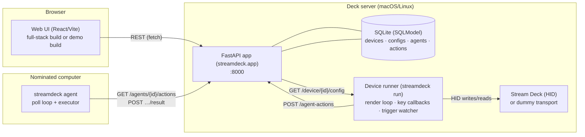
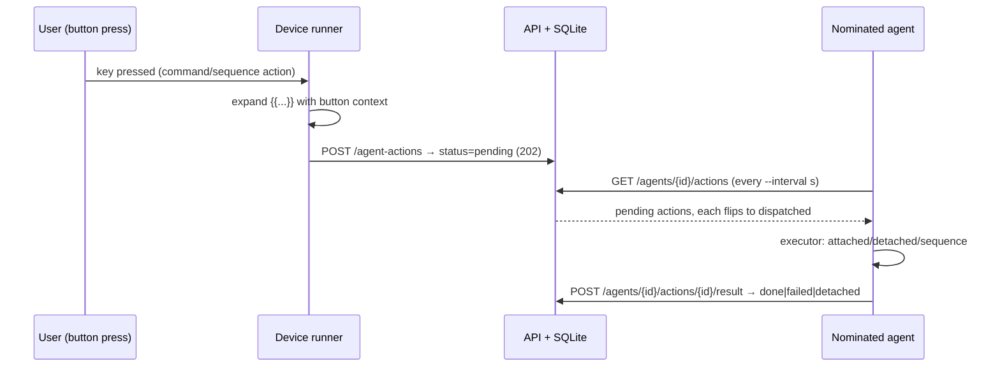

# Architecture overview

Who talks to what, and why it's shaped that way. The stack has four moving
parts — one API process, one SQLite database, one web UI, and up to two
device-side programs (runner, agent) — connected only by **HTTP + JSON**.

## The system in one diagram

| Piece | Process | Talks to |
| --- | --- | --- |
| **API** (`streamdeck/app.py`, served by `streamdeck serve`) | FastAPI + uvicorn | SQLite; enumerates decks via a transport to refresh `connected` status |
| **Database** (`streamdeck/db.py`, SQLModel) | SQLite file (`STREAMDECK_DB`) | Tables: `streamdeckdevice`, `streamdeckconfig`, `agent`, `agentaction` |
| **Web UI** (`frontend/`) | static SPA served by `streamdeck ui`/`demo` | API only (fetch + JSON) |
| **Device runner** (`streamdeck run`) | Python process holding the deck | Deck (HID); API (`GET /device/{id}/config`, `POST /agent-actions`, `GET /config/{id}`) |
| **Agent** (`streamdeck agent`) | Python process on any computer | API only (register, poll, report) |

The runner and agent are **peers of the API, not parts of it** — kill the
runner and the API serves the UI fine; kill the API and the runner keeps
rendering its already-loaded config (fetch failures log and retry later).

## The database models

Four rows types (SQLModel, `streamdeck/models.py`):

- **StreamDeckDevice** — a physical/serial device id, human-name `type`,
  `connected` flag, `currentConfigId`, `activeAgentId`.
- **StreamDeckConfig** — `name`, `deviceType` (kebab id), and two
  **schema-less JSON columns**: `buttons` and `triggers`.
- **Agent** — a nominated computer (stable client-generated UUID,
  snake_case fields).
- **AgentAction** — one queued action: `agentId`, `action` (JSON),
  `status` (`pending → dispatched → done|failed`), `result` (JSON).

## The queue → poll → result lifecycle

Command/sequence presses don't execute inside the runner — they travel:

Why a queue instead of a direct call? The deck server and the target
computer may not be reachable from each other (different networks), and the
runner must never block its render/callback threads on a command's runtime.
The queue makes execution **asynchronous and auditable** — every action row
records what was asked, when it was handed out, and what came back.

## Why the JSON-column dialect is the way it is

The config's `buttons` (and `triggers`, and an action's payload) are
**schema-less JSON columns**, and that's a deliberate decision, not laziness:

- **The UI owns rich structure** (toggle states, fonts, sequences with
  nesting) that would otherwise leak into SQL migrations on every feature.
- **The consumers defend instead of validate.** The runner renders blank
  keys for corrupt button configs; the agent answers garbage actions with
  structured `failed` results; the trigger evaluator treats malformed
  blocks as no-match ([crash-safety](crash-safety.md)). One bad config
  degrades one key, never the stack.
- **The dialect cost is paid in one place.** The wire uses camelCase aliases
  (except snake_case agents) and both device-name dialects are mapped —
  rules pinned by parity tests ([P6](../reference/parity.md),
  [P7](../reference/parity.md), [P9](../reference/parity.md), and the
  "quirks" section of [docs/parity.md](../../parity.md)).

## The runner's two loops

`run_deck` (one loop per deck) runs three concurrent activities:

1. **Main loop** — blocks while the deck is open and not told to exit.
2. **Animate thread** — 30 fps; pulls the next frame for every playing
   animation source and writes it to each button showing it
   ([animation pipeline](animation-pipeline.md)).
3. **Trigger watcher** — 5 s daemon; probes the environment and applies the
   current config when its triggers match ([triggers reference](../reference/triggers.md)).

Plus an event path: **key callbacks** fire on press/release, dispatch the
button's action (exit / animation control / switch-config / command /
sequence) and repaint the key.

## The transport seam

All deck I/O goes through the vendored core's `DeviceManager`. The
`STREAMDECK_TRANSPORT` env var selects the transport: `libusb` (real HID
hardware; the default) or `dummy` (emulated decks — one per known Elgato
product id, stable synthetic serials like `DUMMY0fd90060`). Everything above
the transport — rendering, callbacks, tests, E2E — is identical, which is
why the whole stack is testable without hardware
([testing philosophy](testing-philosophy.md)).

## Who executes what

| Action type | Executed by | Where |
| --- | --- | --- |
| `exit` | runner | deck server |
| `pause` / `play` / `toggle-animation` | runner | deck server |
| `switch-config` | runner (fetches the config from the API) | deck server |
| `command` (attached/detached) | **agent** (nominated computer) | target machine |
| `sequence` | **agent** (each step through the same dispatch) | target machine |

The split is intentional: deck-physical concerns live with the deck;
*computer* work (running commands) lives on nominated computers, so one
Stream Deck can drive several machines
([nominate-a-computer how-to](../how-to/nominate-agents.md)).

## Startup order (what `serve` initializes)

`streamdeck serve` → `init_db()` (create tables; idempotently `ALTER TABLE`
a legacy DB to add `triggers`) → uvicorn serves the app; a `startup` event
re-runs `init_db` defensively. `GET /devices` upserts newly seen decks by
serial so the UI always has rows to assign against.