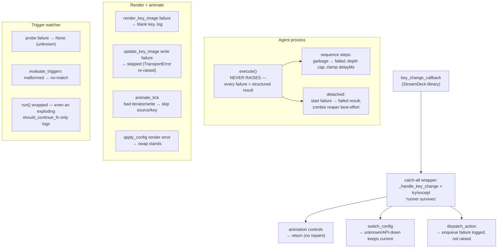

# Crash-safety design

Everything in this stack that can be *fed garbage by the outside world*
defends instead of validating. A config is user JSON, an action payload
travels over HTTP, images arrive from the internet, probes run in a
subprocess — and none of them may take the stack down. This page maps each
catch-all layer, why it exists, and the test that pins it.

## The layers

### 1. The callback wrapper

A raising key callback can break the vendored StreamDeck library's callback
delivery — *every later press silently lost*. So `key_change_callback`
delegates to `_handle_key_change` inside a catch-all:
`[EVENT] key callback error (runner survives)`. The handler itself defends
`buttons.get(key)` and clamps `key >= deck.key_count()`.

### 2. The executor never raises

`agent.execute()` runs inside the agent's poll loop; one bad action must
never kill the loop. Its contract: **every failure mode returns a structured
result with a `status` key** — non-dict actions, missing `executable`,
nonexistent `cwd`, non-dict `env` (collapses `{}`), non-numeric `timeout`
(falls back to 30), unsupported types, and even internal bugs
(`"executor error: …"`). Corrupt `delayMs` clamps to ≤ 60000; sequence
garbage (missing/non-list `steps`, non-dict steps) returns structured
`failed` results; nesting beyond depth 4 returns an error for that step
instead of recursing ([P14](../reference/parity.md), [P18](../reference/parity.md)).

Detached launches add their own containment: a daemon **zombie-reaper**
thread blocks on `os.waitpid` per child; a failing/expired waitpid is
swallowed — reaping is best-effort and never affects the returned result.

Pinned by the garbage-action matrix and never-raises tests in
`tests/test_agent.py`.

### 3. Corrupt images fall back to blank

`update_key_image` wraps rendering: an undecodable source (truncated data
URI, missing file, PIL explosion) logs
`[RENDER] image render failed …` and paints `BLANK_IMAGE` instead — the
key goes blank, the runner lives. Per-key **write** failures are also
skipped; only `TransportError` re-raises, because "deck unplugged" is the
one condition the loops above must notice.

`get_button_config` defends `config = None` / `buttons = None` with the
blank-key shape, because configs arrive from an API/DB and must be defended
against, not trusted.

Pinned by `tests/test_hardening.py`.

### 4. `apply_config` never undoes a swap

The config-swap core (shared by switch-config presses and trigger applies)
first assigns the new config and clears button/pause state, *then* re-renders
inside a try/except — a render hiccup logs and the **swap stands**. A
failed switch (unknown id, API down) never reaches the swap: the current
config stays ([P15](../reference/parity.md)).

### 5. The trigger watcher

The watcher polls forever on a daemon thread, so containment is layered:

- **Probes**: any failure (timeout, non-zero exit, missing binary,
  exception) → logged, treated as "unknown", never propagated
  ([triggers reference](../reference/triggers.md#semantics)).
- **Evaluator**: pure and total — malformed trigger shapes are no-match,
  never a raise.
- **The loop itself**: even an exploding injected `should_continue_fn` is
  caught by `run()`'s outer guard (a judge-round fix after a mutation
  showed the loop could die from a test seam) — the watcher logs and
  returns instead of taking the runner down.

Pinned by `tests/test_triggers.py` (probe-failure matrix,
never-raises-on-exploding-should_continue, apply-retry).

### 6. TransportError isolation

`TransportError` (deck gone mid-write) is the **one** exception the render
and animate paths deliberately re-raise: the animate loop treats it as
"deck gone" and stops; the runner's finally-block closes the deck.
Everything else — per-key write errors, per-source iterator exhaustion — is
skipped so one bad key or one corrupt GIF can't stop the other 31 from
animating.

## Why defense over validation

The API's `buttons`/`triggers`/`action` columns are schema-less JSON
([architecture](architecture.md#why-the-json-column-dialect-is-the-way-it-is)):
validation at the boundary would reject *future* shapes and make the API
fragile to UI evolution. Instead, each consumer degrades gracefully:

| Consumer | Garbage it defends against | Behavior |
| --- | --- | --- |
| runner render | corrupt image, missing keys | blank key, log |
| runner callback | unknown key, raising action | callback logged, loop continues |
| agent executor | any malformed action | structured `{"status": "failed", "error": …}` |
| trigger watcher | malformed triggers, dead probes | no-match, keep polling |

The trade-off: bad data surfaces in **logs**, not in API errors. That's the
documented trade — hardware-adjacent processes must keep running, and a
bad button is visible on the deck itself.

## One-status-list-or-many

A subtle crash-safety adjacent lesson (round 7): once an executor has
**multiple success statuses** (`done` for attached, `detached` for
fire-and-forget), every aggregation/abort site must enumerate them — a
`!= "done"` check silently treats detached launches as failures and aborts
`stopOnError` sequences after a *successful* step. The rule is now a parity
note ([P18](../reference/parity.md)) and a judge-certified test
(`test_detached_result_status_is_detached_via_roundtrip_wire` and the
sequence aggregation tests).