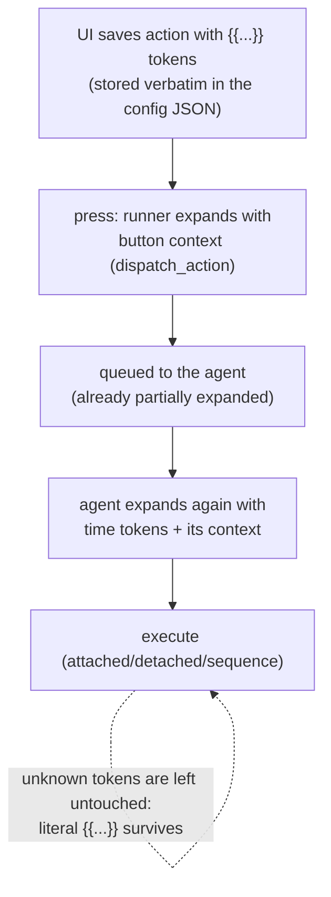

# Template variables

`{{name}}` tokens in command actions get real values at press time. The web
UI advertises and inserts them; the **agent expands them just before
execution** so the same action works on any machine.

## The variables

| Token | Expands to | Context source |
| --- | --- | --- |
| `{{button_index}}` | The pressed key's index | runner, at dispatch |
| `{{device_id}}` | Device serial (deck the press came from) | runner, at dispatch |
| `{{toggle_state}}` | Current toggle-state index (0-based) | runner, at dispatch |
| `{{config_name}}` | Active config's name | runner, at dispatch |
| `{{timestamp}}` | Unix seconds | agent, at expansion |
| `{{date}}` | `YYYY-MM-DD` | agent, at expansion |
| `{{time}}` | `HH:MM:SS` | agent, at expansion |

Both lists are the same by construction: the UI's `TEMPLATE_VARIABLES`
(`frontend/src/types/streamdeck.ts`) and the agent's expansion context are
kept in lockstep by [parity rule P1](../reference/parity.md) (with tests on
each side).

## Where expansion happens (and where it doesn't)



Two expansion points, on purpose:

1. **Runner (press time)** injects the *button context* — only the runner
   knows which key was pressed, on which device, in which toggle state and
   config. It expands the whole action dict (`dispatch_action` →
   `expand_template_vars`).
2. **Agent (execution time)** expands with its own context (time tokens are
   always available; the button context already arrived in the payload).
   Expansion is idempotent — already-expanded text simply has no tokens
   left.

Expansion **recurses**: strings, dicts and lists are all walked, so tokens
work in `executable`, `arguments`, `cwd`, `env` values — and inside every
step of a [sequence](../how-to/multi-step-sequences.md) — with the same
button context (P1; the sequence case got its own recursion + end-to-end
stdout tests in round 7).

**Unknown variables stay literal.** `{{not_a_variable}}` is untouched, so
text that merely looks like a token survives.

## Where each field lands

| Field | Expanded at | Example |
| --- | --- | --- |
| `executable` | runner + agent | `/usr/bin/say` |
| `arguments` | runner + agent | `button {{button_index}} pressed at {{time}}` |
| `cwd` | runner + agent | `/tmp/{{config_name}}` |
| `env` values | runner + agent | `{"SD_BUTTON": "{{button_index}}"}` |
| sequence `steps` | runner + agent (recursive) | per-step `arguments` |

```python
# Expansion is a pure function (streamdeck/agent.py):
from streamdeck.agent import expand_template_vars

expand_template_vars(
    {"arguments": "echo {{button_index}} at {{time}}"},
    {"button_index": 3},
)
# {'arguments': 'echo 3 at 14:30:00'}   (time filled at expansion)
```

## UI affordances

- **Label-row popovers** — the `{ }` icon next to Executable/Arguments/cwd
  appends a variable chosen from a list.
- **Inline completion** — typing `{{` at the end of a value pops the same
  list; accepting completes the closing braces too
  ([completion how-to](../how-to/completion.md)).

```ts
// From e2e/parity-demo.spec.ts
// ("action editor inserts template variables into the arguments field"):
await argsInput.fill("echo ");
await templateButton(page, "Arguments").click();
await page.getByText("{{button_index}}").first().click();
await expect(argsInput).toHaveValue("echo {{button_index}}");
```

## Testing

- Runner-side context injection: `test_runner_dispatch_expands_button_context`,
  `test_toggle_state_context_expands_in_action`.
- Agent-side expansion incl. env/cwd: `test_execute_expands_variables_with_context`,
  `test_execute_still_expands_without_context`.
- Sequence recursion: round-7 tests in `tests/test_agent.py`
  (recursion unit test + end-to-end stdout expansion).
- UI insertion: parity-demo template-var specs ([P1](../reference/parity.md)).