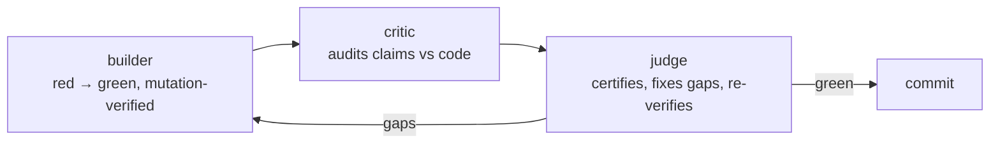

# Testing philosophy

This project treats tests as the *specification*. Every feature lands with
tests that pin both sides of the wire; every behavioral change proves its
test has teeth; every round is reviewed by more than its author. This page
explains the practice — the [run-tests how-to](../how-to/run-tests.md) has
the commands.

## The parity contract is the spec

[docs/parity.md](../../parity.md) holds 18 rules (P1–P18), one per feature
surface, each enforced by tests in `tests/test_parity.py` (plus the
feature's own tests and E2E specs). If a parity test fails, the frontend
and backend have drifted — fix the code or update both sides deliberately.

Why a *documented contract with an executable form* instead of only tests:
the document records **intent** ("agents are snake_case *on purpose*",
"PUT replaces the whole row *on purpose*"), so a well-meaning refactor
doesn't "fix" a pinned dialect quirk. The quirks section of
[docs/parity.md](../../parity.md#backend-quirks-the-frontend-tolerates-do-not-fix-silently)
is exactly this: documented, tested, do-not-touch.

## Red → green

New behavior starts as a failing test, then implementation makes it pass.
The suite structure supports it:

- **pytest** (`tests/`, 146 tests, hardware deselected): the
  executor, runner, triggers, API dialect, CLI surface. Shared fixtures
  (`tests/conftest.py`) give each test a fresh SQLite file and force the
  dummy transport — the *real* library code path, emulated wire.
- **Playwright** (`e2e/`, 4 projects, 48 tests): the same parity assertions
  through the real UI. Two pairs: demo (`demo-ui`, `parity-demo` — no
  backend, in-browser mock) and full-stack (`full-stack`,
  `parity-fullstack` — real API with dummy-transport decks).

Full-stack specs assert **structurally** (`response.json()` +
`toMatchObject`) rather than string-matching compact JSON, and wait on the
*success toast* rather than button-disabled states — both lessons from
flaky earlier rounds ([roadmap](../../roadmap.md)).

## Deterministic UI under test

The UI was shaped by its tests, deliberately:

- The executable/arguments autocomplete is a **controlled dropdown**
  (`CommandInput`), not `<datalist>` — datalist popup behavior varies by
  browser (Chrome shows it only after two characters), which made E2E
  nondeterministic. The dropdown is fully controlled: keyboard, click, and
  `data-testid="command-suggestion-list"` behave identically everywhere
  ([completion how-to](../how-to/completion.md)).
- Radix switches with two instances on one panel are **aria-labeled**
  ("Stop on Error") because an unlabeled `getByRole("switch")` is a
  strict-mode violation.
- Sequence step fields are scoped by `data-testid="sequence-step-N"` —
  top-level placeholders also exist inside the toggle-state editor.
- Playwright port ownership is fixed per project (demo 8080, full-stack UI
  8081, API 8000); servers are reused, not raced.

## Mutation verification

A passing test proves nothing about its *teeth*. The practice: **mutate the
code so the behavior breaks, run the test, confirm it fails, revert.**
Examples from the project's rounds:

| Mutation | Test that must fail |
| --- | --- |
| abort-on-any-failure in sequences (vs `stopOnError`) | continue-on-error → `partial` test |
| `and False` on the sequence depth cap | depth-4 cap test |
| remove the `delayMs` clamp | sanitizer + clamp tests |
| gate dispatch back to `command`-only | `test_sequence_action_reaches_agent_queue` |
| disable the UI "Add step" handler **+ rebuild bundles** | all demo sequence E2E fail |
| reorder `closed_event.set()` after `deck.close()` | `test_exit_sets_closed_event_before_closing_deck` |

Two mutation-era rules learned the hard way:

1. **Frontend mutations need `scripts/build-frontend.sh`** — E2E serves
   prebuilt bundles; a source-only mutation silently tests stale code.
2. **Thread-start tests need a gate** — a test that flips shared state
   immediately after starting a thread lets the mutant path never execute;
   the mutation "passes" and proves nothing (the R5 startup-race lesson).

## Builder → critic → judge

Feature rounds follow a loop (recorded per round in
[docs/roadmap.md](../../roadmap.md)):

- The **builder** implements and self-verifies (tests, mutations, E2E).
- The **critic** audits: are the claimed tests real? do the mutations have
  teeth? is anything flake-prone?
- The **judge** certifies or extends — historically by *adding* the tests
  the builder missed (env-reaches-subprocess, hardening sweep, the
  detached-aggregation fix in round 7: a sequence's `stopOnError` treated a
  successful `detached` step as a failure because only `"done"` counted as
  success — see [crash-safety](crash-safety.md#one-status-list-or-many)).

The loop's history is the [roadmap](../../roadmap.md); the parity table
grows one row per feature round.

## Hardware is opt-in, emulation is first-class

The `dummy` transport emulates one deck per Elgato product id with stable
synthetic serials — so `tests/` and the full-stack E2E exercise the real
library path (encode/render/transport writes) with zero hardware. Real
hardware smoke tests exist (`-m hardware`) and are **deselected by
default**; CI never needs a deck. The polyrepo ancestor's suite
(`python-elgato-streamdeck/test/test.py`) also runs hardware-free through
the same transport, keeping the vendored core honest in both repos.