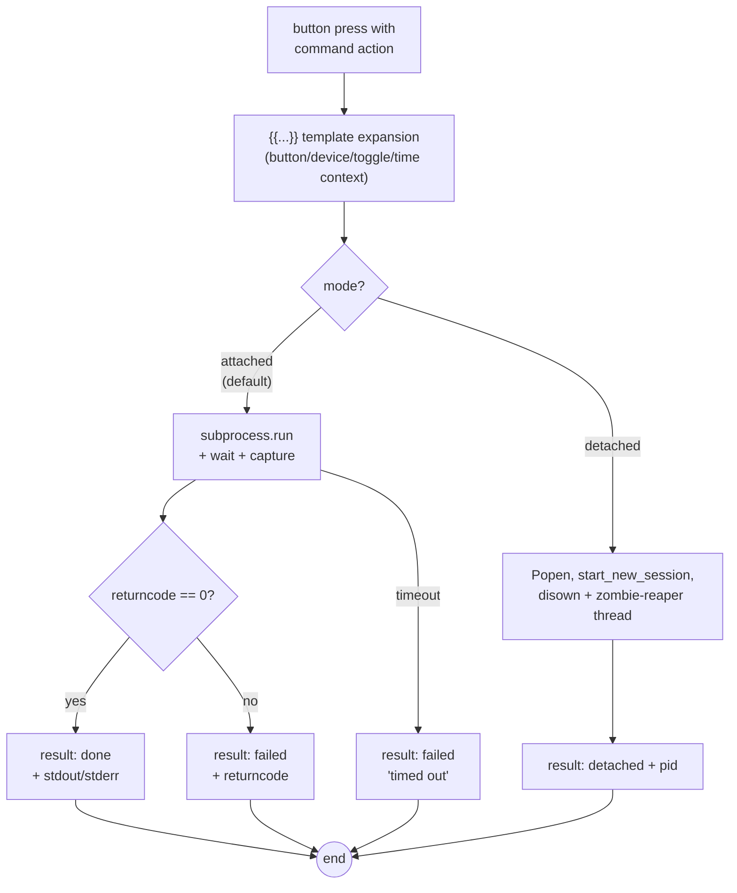

# Run commands attached vs detached

**Goal:** choose correctly between waiting for a command (and getting its
output) and firing it into the background — and know what each mode reports.

## Mode semantics

| | `attached` (default) | `detached` |
| --- | --- | --- |
| Waits? | yes, up to `timeout` seconds | no — returns immediately |
| Output captured? | stdout/stderr (last 4000 chars each) | no (`DEVNULL`) |
| Success status | `"done"` (rc 0) / `"failed"` (rc ≠ 0) | `"detached"` + child `pid` |
| Timeout kills? | yes (default 30 s) | never |
| Child survives the agent? | — | yes (`start_new_session=True`) |
| Use for | things you want the result of | things you want to *start* |



## Steps (UI)

1. Open a config → click a button → **Action** tab.
2. **Action Type → Command**. Fill **Executable** (e.g. `/usr/bin/open`)
   and **Arguments** (e.g. `-a Slack`).
3. **Launch Mode** select:
   - **Attached (wait for completion)** — the default; waits and reports.
   - **Detached (fire and forget)** — starts and moves on.

   The UI leaves `"mode"` out of the JSON when attached — it is implicit:

   ```ts
   // From e2e/parity-demo.spec.ts ("attached mode stays implicit"):
   await expect(pre).toContainText('"executable": "echo"');
   await expect(pre).not.toContainText('"mode"');
   ```

4. **Timeout (seconds)** applies to attached only (default **30**, min 1,
   max 600 in the editor; the executor falls back to 30 on corrupt values).
5. Optional **Working Directory** (`cwd`) and **Environment Variables**
   (`env`: KEY/value rows) apply to both modes.
6. **Save**.

The wire form the agent executor consumes:

```json
{
  "type": "command",
  "executable": "/usr/bin/env",
  "arguments": "echo {{button_index}}",
  "mode": "detached",
  "timeout": 42,
  "env": { "SD_BUTTON": "{{button_index}}" },
  "cwd": "/tmp"
}
```

## Steps (config JSON directly)

```json
{ "type": "command", "executable": "/bin/echo", "arguments": "hello" }
{ "type": "command", "executable": "/Applications/Slack.app/Contents/MacOS/Slack", "mode": "detached" }
{ "type": "command", "executable": "/usr/bin/osascript", "arguments": "-e 'display dialog \"hi\"'", "timeout": 5 }
```

## Where the command runs

Where a press executes depends on the device's **nominated agent**:

- **Agent nominated** ([how-to](nominate-agents.md)): the runner enqueues the
  action to the API; the nominated computer's `streamdeck agent` polls it
  down and executes there.
- **No agent** (or the API unreachable): the runner executes the action
  **locally** — on the machine the runner itself runs on — through the same
  executor the remote agent uses. Launch modes, sequences, timeouts and the
  never-raises contract behave identically; the terminal prints
  `[ACTION] queue dispatch unavailable … — executing locally` followed by
  the local result status. (Before the fallback existed, this case logged
  `[ACTION] dispatch failed` and dropped the press.)

## Verify

- **Attached, success:** point the executable at `/bin/true` → the action
  result reports `status: "done", returncode: 0` (visible via the agent
  queue: `GET /agents/{id}/actions` + the result post — see the
  [API reference](../reference/api.md)).
- **Attached, failure:** `/bin/false` → `status: "failed", returncode: 1`.
- **Attached, timeout:** `/bin/sleep 99` with `timeout: 2` → `failed` with
  "timed out".
- **Detached:** `/bin/echo hi` detached → `status: "detached"` **with a
  `pid`**, and the action completes immediately. The child is disowned into
  its own session and reaped by a daemon thread (no zombies).

The never-raises contract is the safety net under all of this: a missing
executable, a nonexistent `cwd`, a non-dict `env`, a non-numeric `timeout` —
all come back as structured `failed` results, never an exception
([crash-safety](../explanation/crash-safety.md#2-the-executor-never-raises)).

## Gotchas

- **Detached has no timeout and no output** — by design. If you need the
  result, attach.
- **Arguments are shell-style text** split by the agent (`shlex`-less simple
  split of the string); quoting rules are the shell's, so `-e 'tell app
  "Slack" to activate'` works as you'd type it in a terminal.
- **`timeout` is per command.** In [sequences](multi-step-sequences.md) there
  is deliberately no sequence-level timeout — each step's own timeout binds.

## Related

- [Build a multi-step sequence](multi-step-sequences.md)
- [Config schema: CommandAction](../reference/config-schema.md#commandaction)
- [Explanation: architecture — who executes what](../explanation/architecture.md#who-executes-what)