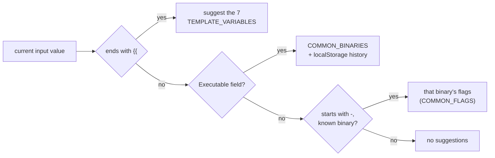

# Use shell completion and input autocomplete

**Goal:** stop typing full paths and flags — completion exists on both the
CLI (shell-level) and in the web UI's command fields.

## CLI: shell completion (typer built-in)

The `streamdeck` CLI keeps typer's shell completion enabled (parity rule
P17 — it was once disabled and is regression-pinned by `tests/test_cli.py`):

```sh
# install once per shell (bash / zsh / fish):
streamdeck --install-completion

# or print the script to inspect/customize:
streamdeck --show-completion
```

Completion covers command names and options for every subcommand. The parse
path stays lazy (`--help` completes in well under a second — imports of
uvicorn/Pillow/db only happen when a command actually runs), so completion
scripts stay fast to generate.

**Verify:**

```sh
streamdeck --help          # shows --install-completion / --show-completion
streamdeck --show-completion zsh | head   # prints a zsh script
```

## UI: executable + arguments autocomplete

The ActionEditor's **Executable** and **Arguments** fields (and the same
fields inside [sequence step cards](multi-step-sequences.md)) are
`CommandInput` components — a controlled dropdown, not a native `datalist`
(datalist UX varies per browser; this dropdown is deterministic and
testable). Suggestions (max 8, filtered case-insensitively by the current
prefix):

| Field | Sources |
| --- | --- |
| Executable | static `COMMON_BINARIES` list (a browser can't scan your PATH) **+ your typed history** |
| Arguments | flags for the *known binary* named in Executable, after a leading `-` |
| Both | the 7 template variables, when the value ends with `{{` |



### What's in the static lists

`COMMON_BINARIES` (macOS paths): `/usr/bin/env`, `/bin/sh`,
`/usr/bin/open`, `/usr/bin/osascript`, `/usr/local/bin/brew`,
`/opt/homebrew/bin/brew`, `/usr/sbin/systemsetup`, `/usr/bin/defaults`,
`/usr/bin/curl`, `/usr/bin/caffeinate`.

`COMMON_FLAGS` (per binary): `osascript → -e`, `open → -a, -g`,
`brew → install, services`, `defaults → read, write`, `curl → -s, -o`.

### History

Typing an executable and saving a config records it (only **absolute
paths**, deduped, most-recent-first, cap **10**) in
`localStorage["streamdeck_recent_executables"]` — so your bespoke
`/opt/tools/deploy.sh` starts suggesting after the first save, even though
it's not in the static list.

### Keyboard

- First item is highlighted when the list opens — **Enter** accepts it.
- **↑ / ↓** navigate, **Enter** accepts, **Esc** closes, **click** selects.
- Picking a template variable completes the **closing braces** too: typing
  `echo {{` and pressing Enter yields `echo {{button_index}}`.

```ts
// From e2e/parity-demo.spec.ts
// ("executable input suggests known binaries and accepts keyboard selection"):
await execInput.fill("/us");
const list = page.getByTestId("command-suggestion-list");
await expect(list).toContainText("/usr/bin/env");
await execInput.press("Enter");
await expect(execInput).toHaveValue("/usr/bin/env");

// ("template variables complete inline when the value ends with {{"):
await argsInput.fill("echo {{");
await expect(list).toContainText("{{button_index}}");
await argsInput.press("Enter");
await expect(argsInput).toHaveValue("echo {{button_index}}");
```

### The label-row popovers

Each field label still carries a **template-variables popover** (the `{ }`
icon button) that *appends* a chosen variable to the field — the dropdown
completes *inline*; the popover is the browse-and-append affordance. Both
paths write the same tokens ([template variables](../explanation/template-variables.md)).

## Verify (UI)

1. Create a config → button → **Action** → **Command**.
2. In **Executable** type `/us` → the list shows `/usr/bin/env` and
   `/usr/bin/open`; **Enter** accepts the highlighted one.
3. In **Arguments** type `echo {{` → the variables list appears; **Enter**
   completes to `echo {{button_index}}`.
4. Set Executable to `/usr/bin/osascript`, then type `-` in **Arguments** →
   `-e` is suggested (and flags of *other* binaries don't leak in).
5. Save, reload, type a prefix of the path you saved → it suggests from
   history.

## Related

- [Parity rule P17](../reference/parity.md#the-table-summarized)
- [How-to: multi-step sequences](multi-step-sequences.md) — the same inputs
  appear per step card.
- [Explanation: why a controlled dropdown, not datalist](../explanation/testing-philosophy.md#deterministic-ui-under-test)