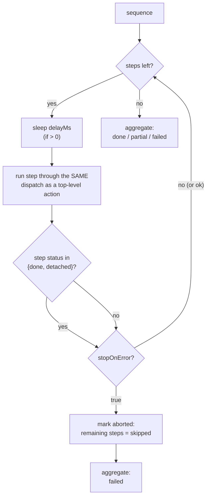

# Build a multi-step sequence

**Goal:** make one button run several actions in order — with per-step
delays, optional stop-on-first-failure, and nesting when you need it.

## The shape

```json
{
  "type": "sequence",
  "steps": [
    { "type": "command", "executable": "/bin/echo", "arguments": "deploy start" },
    { "type": "command", "executable": "/usr/bin/open", "arguments": "-a Terminal", "delayMs": 500 },
    { "type": "command", "executable": "/bin/echo", "arguments": "done" }
  ],
  "stopOnError": false
}
```

| Field | Meaning |
| --- | --- |
| `steps` | list of full actions, run in order. Command actions are what the structured editor hosts; steps may also be nested sequences (capped at depth **4**). |
| `stopOnError` | `false` (default): fire every step. `true`: abort remaining steps on the first **failure**; unexecuted steps report `{"status": "skipped"}`. |
| `delayMs` (per step) | sleep **before** that step. Sanitized: non-numeric/negative → 0; anything above **60000** clamps to 60000. |
| `timeout` (per step, optional) | each step's own command `timeout` binds. There is deliberately **no sequence-level timeout**. |

A `detached` step is a **successful launch**, not a failure — it counts as
success for both `stopOnError` and the aggregate status
(`docs/parity.md` P18; the aggregation bug class this rule prevents is
described in the [testing philosophy](../explanation/testing-philosophy.md#mutation-verification)).

## Outcome aggregation

| Situation | Sequence result `status` |
| --- | --- |
| every step succeeded (`done` and/or `detached`) | `"done"` |
| every step failed | `"failed"` |
| some succeeded, some failed | `"partial"` |
| `stopOnError` triggered | `"failed"` (later steps `"skipped"`) |
| nesting deeper than 4 | the deep step returns a structured error; no crash |



## Steps (UI — structured editor)

1. Open a config → click a button → **Action** tab.
2. **Action Type → Sequence (run multiple actions)**.
3. **Add step** — each step card hosts:
   - **Executable** / **Arguments** (with the same [completion](completion.md)
     as top-level command fields),
   - **Launch Mode** (Attached/Detached, per step),
   - **Delay before step (ms)** (number input),
   - a **remove** (trash) button.
4. Sequence-level **Stop on Error** switch — abort remaining steps after the
   first failure.
5. **Save.** The **JSON View** tab shows the nested wire form:

```ts
// From e2e/parity-demo.spec.ts
// ("sequence editor supports delay, stopOnError, and persists them"):
const delayInput = page.getByTestId("sequence-step-0").locator('input[type="number"]');
await delayInput.fill("250");
await page.getByRole("switch", { name: "Stop on Error" }).click();
// ... save + reload ...
await expect(pre).toContainText('"delayMs": 250');
await expect(pre).toContainText('"stopOnError": true');
```

> Selector tip from the same spec: step fields are scoped by
> `data-testid="sequence-step-N"` because the top-level placeholders
> (`/path/to/executable`, `--flag value`) also exist in the toggle-state
> editor — `getByTestId("sequence-step-0").getByPlaceholder(...)` avoids the
> strict-mode collision.

### Steps the cards don't host

Non-command step types (a nested `switch-config`, an `exit`, hand-rolled
nested sequences) round-trip through the **Advanced: edit steps as JSON**
textarea at the bottom of the editor. **Apply JSON** replaces the whole
steps array; invalid JSON keeps the textarea open for correction.

## Steps (config JSON directly)

Edit via **JSON View** or `PUT /config/{id}`:

```json
{
  "type": "sequence",
  "steps": [
    { "type": "command", "executable": "/bin/echo", "arguments": "one" },
    { "type": "command", "executable": "/bin/sleep", "arguments": "1", "delayMs": 1000 },
    {
      "type": "sequence",
      "steps": [
        { "type": "command", "executable": "/bin/echo", "arguments": "nested" }
      ]
    }
  ],
  "stopOnError": true
}
```

Nesting works because the executor runs every step through the **same**
dispatch path as top-level actions (`_execute_one`); a sequence step that is
itself a sequence recurses with `depth + 1` up to `MAX_SEQUENCE_DEPTH = 4`.
Deeper nesting returns a structured error for that step — runaway recursive
configs can't hang the agent loop.

## Verify

1. Save a two-step sequence (`/bin/echo one`, then `/bin/echo two`) and
   reload the editor — both step cards come back with values.
2. `GET /config/{id}` shows the nested structure:

```sh
curl -s http://127.0.0.1:8000/config/$CONFIG_ID | python3 -m json.tool
```

The real-API round-trip is pinned end to end:

```ts
// From e2e/parity-fullstack.spec.ts
// ("sequence action with two steps round-trips through the real API"):
expect(sequenceAction).toMatchObject({
  type: "sequence",
  steps: [
    { type: "command", executable: "/bin/echo", arguments: "hello" },
    { type: "command", executable: "/usr/bin/true" },
  ],
});
```

3. Behavior (from `tests/test_agent.py`): all-success → `done`; make step 2
   fail → `partial` (step 3 still ran); with `stopOnError` → `failed` and
   step 3 reported `skipped`; corrupt shapes (missing/non-list `steps`,
   non-dict steps) → structured `failed`, never a raise.

## Gotchas

- **Sequences are dict-only** — no bare-string form (they carry a payload a
  bare string can't hold).
- **Template variables expand per step** with the same button context —
  `{{button_index}}` inside a step's arguments works
  ([template variables](../explanation/template-variables.md)).
- **`delayMs` sleeps before every step**, including the first.
- **Results are per step.** The sequence's aggregate status is reported
  through the agent result; individual step results ride in the result
  payload's `steps` array.

## Related

- [Run commands attached vs detached](attached-detached-commands.md) — the
  per-step fields in depth.
- [Config schema: SequenceAction](../reference/config-schema.md#sequenceaction)
- [Parity rule P18](../reference/parity.md#the-table-summarized)