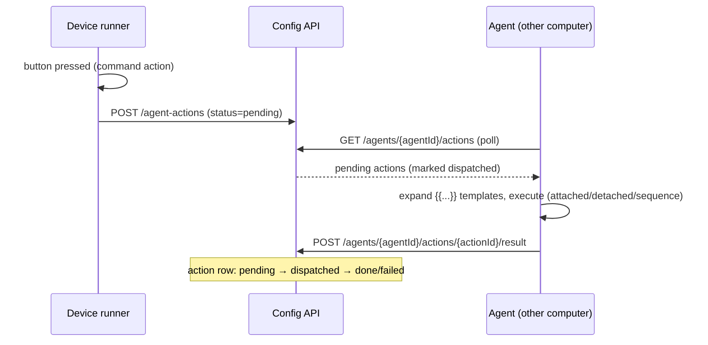

# Nominate an agent computer

**Goal:** have button presses execute on *another computer* — one Stream
Deck driving several machines ("nominate a computer").

## How it works

1. On the target machine you run `streamdeck agent --server <API-URL>`. It
   registers itself (idempotent upsert) and then polls the API for queued
   actions.
2. In the web UI you **nominate** that agent for a device.
3. Command (and sequence) actions pressed on that device are **enqueued** to
   the API instead of being run anywhere locally; the nominated agent's poll
   picks them up, executes them, and reports results.



## Step 1 — Register the agent

On the computer that should *execute* commands:

```sh
streamdeck agent --server http://<deck-server-host>:8000
```

| Option | Default | Meaning |
| --- | --- | --- |
| `--server` | `$STREAMDECK_API` or `http://localhost:8000` | API base URL |
| `--interval` | `5.0` | poll interval in seconds |

The agent derives a **stable id** (a UUIDv5 of the hostname, persisted in
`~/.streamdeck-agent-id`) so re-registrations upsert instead of duplicating.
It keeps polling until stopped; if the server loses its registration (fresh
database), the agent re-registers on the next poll.

**Verify:** in the web UI, **Agents** now lists the machine (hostname, user,
platform, status) — or via `curl http://127.0.0.1:8000/agents`:

```json
[{"id":"docs-agent-studio-1","hostname":"studio-mac.local","user":"lewiscowles",
  "platform":"macOS 15 (arm64)","active":true,"last_seen":"2026-09-20T12:00:00+0100"}]
```

Note the dialect: agents are **snake_case** (`last_seen`) — the one model
without camelCase aliases ([API reference](../reference/api.md#dialect-rules)).


## Step 2 — Nominate the agent for a device

**Via UI (Devices page):** on the device card click **Nominate**, choose the
computer in the dialog, confirm. The card shows the nominated agent and
gains a **Clear agent** control (falls back to local handling).

**Via UI (Agents page):** the **Nominate for a device** section lists every
device with a select + **Nominate** button.

**Via API:**

```sh
curl -X PUT http://127.0.0.1:8000/device/<DEVICE_ID>/agent/<AGENT_ID>
# DELETE /device/<DEVICE_ID>/agent   → clear the nomination
```


The nomination flow as automated in
`e2e/parity-demo.spec.ts` ("nominate an agent from the device card"):

```ts
await page.getByRole("button", { name: /^nominate$/i }).first().click();
await page.getByRole("dialog").getByRole("combobox").click();
await page.getByRole("option", { name: /studio-mac\.local/i }).click();
await page.getByRole("dialog").getByRole("button", { name: /^nominate$/i }).click();
await expect(page.getByText(/agent nominated/i).first()).toBeVisible();
await expect(page.getByText("demo-agent-studio").first()).toBeVisible();
```

## Step 3 — Point actions at the agent

Nothing extra to configure: with a nomination in place, every
**command/sequence** press on that device is enqueued to the nominated agent
(template variables expand agent-side with button context — see
[template variables](../explanation/template-variables.md)). Commands that
should run *only* when an agent is present work best with [attached
mode](attached-detached-commands.md) so you get the result back.

## Verify the whole loop

1. With the agent running on machine B and nominated for the device, press a
   command button on the deck (or enqueue via API):
   ```sh
   curl -X POST http://127.0.0.1:8000/agent-actions \
     -H 'Content-Type: application/json' \
     -d '{
       "agentId": "docs-agent-studio-1",
       "deviceId": "DUMMY0fd90060",
       "buttonIndex": 0,
       "action": {"type": "command", "executable": "/bin/echo", "arguments": "hi"},
       "createdAt": "2026-09-20T12:00:00+0100"
     }'
   ```
   (HTTP **202**; `404` if the agentId is unknown.)
2. The agent log shows the action executed; the result row now reads
   `done`/`failed`/`detached` (visible in the DB or via a result POST).

The wire round-trip (queue → poll → result) is pinned by
`tests/test_api.py::test_agent_roundtrip`.

## Remove an agent

**Agents** page → the row's trash control (or `DELETE /agents/{agent_id}`).
Any device nominations pointing at it are cleared first, so no device keeps
a dead nomination.

## Related

- [Explanation: architecture — who executes what](../explanation/architecture.md#who-executes-what)
- [API reference: Agents endpoints](../reference/api.md#agents)
- [Run commands attached vs detached](attached-detached-commands.md)