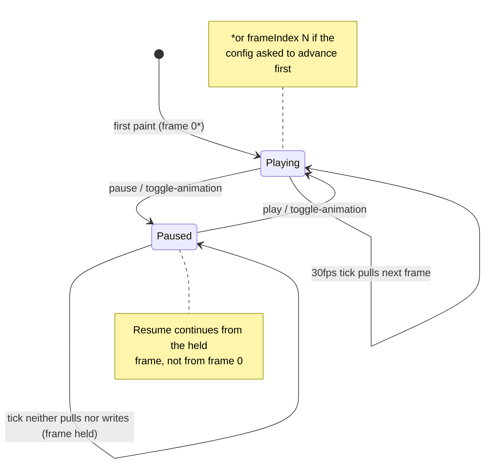

# Pause and resume an animation

**Goal:** hold a GIF on its current frame — from a button press, from the
config, or by toggling — and resume where it left off.

## The model in one paragraph

Pause state lives on the **image source**, not the button: the runner keeps
`paused_images: dict[str, bool]` keyed by the same source string that keys
the frame cache. Because a source's frames are one shared cycle, pausing a
source holds **every button showing it** — consistent with the shared-decode
rule ([animation pipeline](../explanation/animation-pipeline.md)). While
paused, the 30 fps tick neither advances nor rewrites that source, so the
held frame stays on deck and resume continues from that exact position.

Three action names drive it, each usable **bare** (a string) or as a dict:

| Action | Bare string | Dict form | Effect |
| --- | --- | --- | --- |
| Pause | `"pause"` | `{"type": "pause"}` | hold the current frame |
| Resume | `"play"` | `{"type": "play"}` | continue from the held frame |
| Flip | `"toggle-animation"` | `{"type": "toggle-animation"}` | pause if playing, play if paused |



## Option A — pause from another button

1. Give the animated button your GIF ([upload a GIF](animated-gif-button.md)).
2. Pick a second button → **Action** tab → **Action Type → Command** is not
   needed here: this control is a *runner action*, not a command. Set
   **Action Type → No Action** is wrong too — you need the bare-string
   action. Edit the button's action in **JSON View** (or keep reading: the
   structured editor hosts command/sequence/switch-config/exit; bare-string
   runner actions like `pause` are entered through JSON View today).

   In JSON View, give the second button:

   ```json
   {
     "index": 5,
     "idle": { "text": "❚❚" },
     "action": "pause"
   }
   ```

3. Save. Pressing button 6 freezes button 1's GIF on the frame it was on.
   A `"play"` button resumes; `"toggle-animation"` flips.

> **Why no repaint on these presses:** animation-control presses return from
> the key callback *without* repainting. The normal pressed repaint would
> blank the key (these actions configure no pressed image), and re-rendering
> the source would silently advance the shared cycle. The key already shows
> the right frame — held while paused, continuing when playing
> (regression-tested: `test_animation_action_press_keeps_held_frame_visible`).

## Option B — start paused, or start at a chosen frame

The button-level `animation` block configures the initial state:

```json
{
  "index": 0,
  "idle": { "image": "data:image/gif;base64,…" },
  "action": { "type": "command", "executable": "/bin/echo", "arguments": "hi" },
  "animation": { "paused": true, "frameIndex": 3 }
}
```

- `paused: true` — the source renders its frame and **holds** it from the start.
- `frameIndex: N` — the shared cycle is advanced N times **before** the first
  paint (best-effort; a static source has nothing to advance).

Add it in **JSON View** (the structured editor does not host the `animation`
block yet — see [config schema](../reference/config-schema.md#animation)).

## Verify

Run the runner against a dummy/real deck with your config assigned, then:

1. Press the pause button → the GIF freezes mid-animation.
2. Press a `play` button → motion resumes **from the held frame**, not the start.
3. While paused, press the animated button itself → the frame stays visible
   (no blank flash, no advance).

The engine-level guarantees are pinned in `tests/test_runner.py` /
`tests/test_parity.py`:

| Guarantee | Test |
| --- | --- |
| pause holds the current frame | `test_pause_action_holds_frame` |
| resume continues from held position | `test_resume_continues_from_held_position` |
| toggle flips correctly | `test_toggle_animation_action_contract` |
| `animation.paused` honored at start | `test_start_paused_config` |
| pause is shared across buttons | `test_pause_is_shared_across_buttons` |
| press keeps held frame visible | `test_animation_action_press_keeps_held_frame_visible` |

## Semantics worth knowing

- **Pause is shared**: pausing one button's source pauses every button
  showing that same source (one cycle per source, by design). Per-button
  pause is a possible follow-up; the shared decision is recorded in the
  [animation pipeline explanation](../explanation/animation-pipeline.md#why-pause-is-source-keyed).
- **Apply-on-press only**: `pause`/`play`/`toggle-animation` act when the
  key is **pressed** (`state == 1`).
- **`apply_config` clears pauses**: a config switch (button or trigger) resets
  pause state; a `paused: true` animation block re-pauses on re-render.

## Related

- [Upload an animated GIF](animated-gif-button.md)
- [Config schema: `animation`](../reference/config-schema.md#animation) ·
  [actions](../reference/config-schema.md#action)
- [Explanation: the animation pipeline](../explanation/animation-pipeline.md)