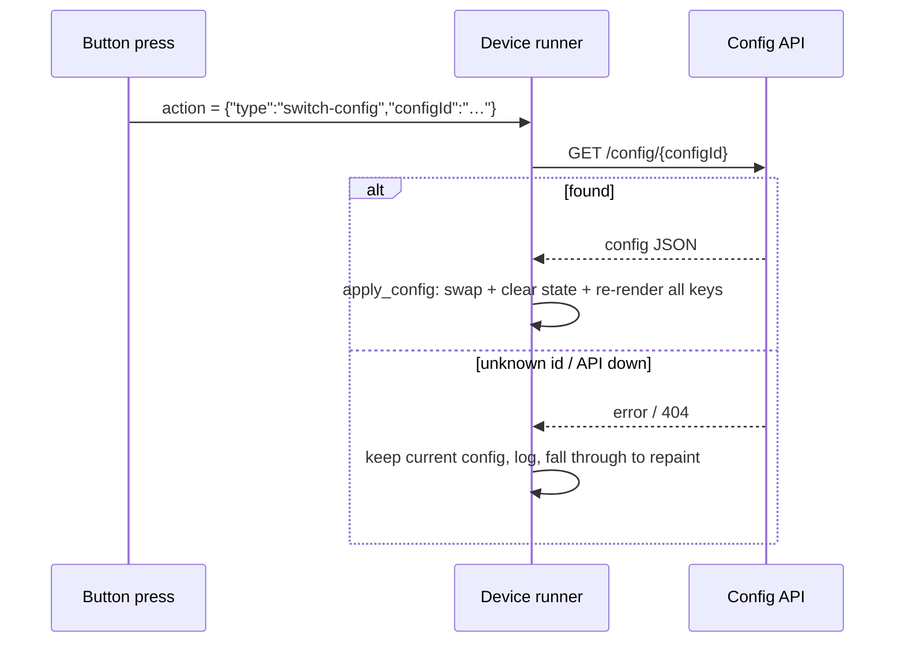

# Switch configs from a button

**Goal:** make a button on the deck swap the device's active config — a
"pages" pattern without extra hardware: one deck, several layouts, deck-driven.

## How it works

The runner accepts a `switch-config` action. On press it fetches the target
config from the API (`GET /config/{config_id}`), swaps it in as the active
config, clears button + animation state, and re-renders every key at idle.

Both wire forms work:

| Form | Example |
| --- | --- |
| Dict (what the UI writes) | `{"type": "switch-config", "configId": "<uuid>"}` |
| Bare string | `"switch-config:<uuid>"` |

Crash-safe by contract: an unknown id or a downed API **keeps the current
config** (the press falls through to normal handling, so the button still
repaints); a render error during the swap never undoes the swap.



## Steps (UI)

1. Create the target config first (e.g. `Comms`) — you need its id.
2. Open the source config → click the button that should switch →
   **Action** tab.
3. **Action Type → Switch Config**. The **Target Config** picker lists every
   config in the store; pick one (it fills the id input) or paste an id into
   **Config ID**.
4. **Save.** JSON View shows the wire form:

```ts
// From e2e/parity-demo.spec.ts
// ("switch-config action offers a config picker and writes the wire form"):
await expect(pre).toContainText('"switch-config"');
await expect(pre).toContainText('"configId"');
```


## Steps (config JSON directly)

```json
{
  "index": 4,
  "idle": { "text": "→ Comms" },
  "action": { "type": "switch-config", "configId": "6b57e5c5-7ec9-4a31-9189-ce60f2ef6a8c" }
}
```

or the bare-string equivalent: `"action": "switch-config:6b57e5c5-…"`.

## Getting the config id

- **Editor URL**: the browser address bar ends in the id while editing.
- **API**: `curl -s http://127.0.0.1:8000/configs | python3 -m json.tool | grep -B2 '"name": "Comms"'`.
- **The picker** in the UI does this lookup for you.

## Verify

1. Assign the source config to a device and run the runner
   ([tutorial 1](../tutorials/zero-to-deck.md#step-6-run-the-device-runner)).
2. Press the switch button → every key re-renders into the target layout.
3. **Failure mode**: stop the API, press again → the runner logs
   `[CONFIG] switch-config: could not fetch '…'` and **keeps** the current
   layout (no crash, no blank deck). Pinned by
   `test_config_switch_api_down_keeps_current_config` and
   `test_config_switch_unknown_config_keeps_current` in `tests/test_runner.py`.
4. The real-API round-trip of the target id is pinned in
   `e2e/parity-fullstack.spec.ts` ("switch-config action round-trips the
   target config id through the real API").

## Behavior notes

- **Triggers re-aim automatically**: after a switch, the trigger watcher
  evaluates the *new* current config's triggers (watchers always read the
  current config — see [triggers how-to](automatic-switching-triggers.md)).
- **Animation pauses clear** on a successful switch (`apply_config` resets
  `paused_images`; see [pause/resume](pause-animation.md)).
- **Assign-vs-switch**: the Devices page **Assign** flow (`PUT
  /device/{id}/config/{config_id}`) persists the assignment server-side; a
  `switch-config` press changes only the *running* device's active config —
  after a runner restart it loads the API-assigned config again.

## Related

- [Set up automatic switching with triggers](automatic-switching-triggers.md)
- [Config schema: SwitchConfigAction](../reference/config-schema.md#switchconfigaction)
- [Explanation: architecture — the runner's two loops](../explanation/architecture.md#the-runners-two-loops)