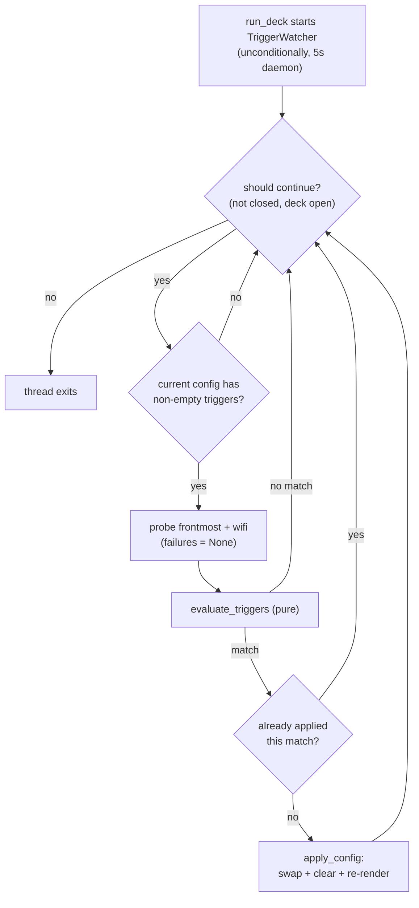

# Triggers block reference

The optional `triggers` block on a config makes the device runner apply that
config automatically while the environment matches. This page is the exact
contract: fields, matching semantics, failure handling, lifecycle.

The schema-less JSON is stored by the API verbatim ([dialect rules](api.md#dialect-rules));
these are the shapes the runner's evaluator understands — anything else
treats as no-match, never a raise.

## Shape

```json
{
  "triggers": {
    "app": ["Slack", "Spotify"],
    "network": { "ssid": "HomeWifi", "interface": "en0" }
  }
}
```

| Field | Type | Meaning |
| --- | --- | --- |
| `app` | string[] | Matches when any listed name is the **frontmost application** (case-insensitive, trimmed) |
| `network.ssid` | string | Matches when the Wi-Fi SSID equals this value (exact, trimmed) |
| `network.interface` | string | Optional wireless interface (default `en0`) |

Branches combine as **OR**: `app` matching OR `network` matching applies the
config. An empty block, a missing block, a non-dict, or malformed entries
(`app` as a string, `network` as a list, …) are all **no-match** — the
evaluator is pure and never raises.

## Semantics

```python
# The pure decision function (streamdeck/triggers.py):
evaluate_triggers(triggers, context) -> bool
#   context = {"frontmost_app": str | None, "wifi_ssid": str | None}
```

| Situation | Result |
| --- | --- |
| `frontmost_app` equals any `app` entry (case-insensitive) | match |
| `wifi_ssid` equals `network.ssid` | match |
| either of the above | match (OR) |
| probe returned `None` (failure / not-macOS / hidden SSID) | no match — *unknown ≠ match* |
| `triggers` missing / empty / malformed | no match |
| both branches absent | no match |

## Runtime behavior

- **Watcher cadence:** every **5 s** (`TriggerWatcher.poll_seconds`), on a
  daemon thread started **unconditionally** by `run_deck`. A triggerless
  current config is a cheap no-op tick; a config reached *later* (API assign
  or a [switch-config press](../how-to/switch-config-button.md)) is armed
  immediately because the watcher re-reads the current config every poll.
- **Probes (macOS-only):**
  - Frontmost app: `osascript -e 'tell application "System Events" to get
    name of first process whose frontmost is true'`, 2 s timeout.
  - SSID: `ipconfig getsummary <interface>` parsed line-by-line for
    `SSID : …`; hidden-network `<ssid>` values are treated as no-SSID. The
    deprecated `airport -I` path is deliberately **not** used (removed on
    macOS Sequoia).
- **Probe failure containment:** a timeout, non-zero exit, missing binary,
  or any exception is logged as `[TRIGGER] probe … failed` and treated as
  "unknown" — probes can never kill the loop.
- **Apply-once:** a match applies the config **once** (`apply_config`:
  swap + clear button/animation state + re-render every key). While the
  trigger still holds, later polls do not re-apply. Re-arming happens when
  the current config changes or the trigger stops and re-starts matching.
- **Priority rule:** triggers evaluate **only from the current config** — an
  explicit device assignment or switch-config press re-aims the watcher;
  there is no cross-config trigger jumping.
- **Apply-once guard key:** the guard compares the config **name**; two
  configs sharing a name can suppress each other's applies (documented
  trade-off — ids exist server-side but not for `--config`-file configs;
  see [roadmap deferred items](../../roadmap.md)).

## Lifecycle



## Round-trip rules

- POST/PUT/GET `/config*` preserve any `triggers` JSON (schema-less column).
- **Whole-row PUT replace semantics:** a body without a `triggers` key
  **clears** the block ([API reference](api.md#configs)).
- The UI's editor writes only the fields above; empty fields are dropped and
  an all-empty block stores no key at all
  ([how-to](../how-to/automatic-switching-triggers.md)).

## Testing

- `tests/test_triggers.py` (35 tests): evaluator matrix, probe-failure
  matrix, apply-once, unconditional arming + switch-into-triggered-config,
  API round-trip with malformed-shape tolerance.
- E2E: parity-demo trio ("writes app + ssid into the config JSON", "survive
  save + reload", "clearing trigger fields removes the triggers block") and
  the parity-fullstack real-API PUT/GET round-trip — all linked from
  [parity rule P16](parity.md).

## macOS specificity

Both probes are macOS-only. On Linux/Windows the probes return `None`, so
triggered configs simply never match there — the rest of the stack
(API, UI, runner, agent) is platform-agnostic.