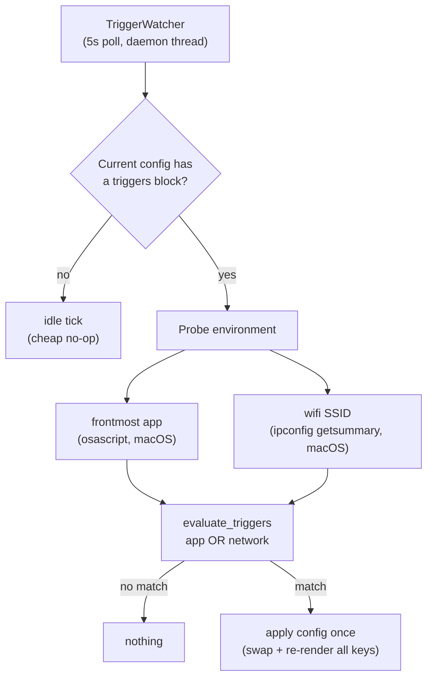

# Tutorial: automate with triggers

*Learning-oriented; ~10 minutes; continues from
[From zero to a working deck](zero-to-deck.md). macOS required for the
environment probes (frontmost app, Wi-Fi SSID).*

Goal: make a config **switch itself onto the deck** when you focus Slack, and
another when you join your home Wi-Fi — no button presses, no API calls.

## The mental model

Every config may carry a `triggers` block describing *when the environment
matches it*. The device runner polls the environment every **5 seconds**;
while the *currently active* config's triggers match, that config is applied.



Key rules (full detail in the [triggers reference](../reference/triggers.md)):

- Triggers evaluate **only from the current config** — a manual press or an
  API assignment re-aims the watcher at whatever is now active.
- A matched config is applied **once** per match; the loop does not re-apply
  on every poll.
- Branches (`app`, `network`) combine as **OR**.
- Failed probes are "unknown" and never match — a dead Wi-Fi probe can't
  randomly trigger a config.

## Step 1 — Start the stack

Two terminals, as in the first tutorial:

```sh
# Terminal 1 — API (dummy transport keeps this hardware-free)
STREAMDECK_TRANSPORT=dummy uvx . streamdeck serve
```

```sh
# Terminal 2 — web UI on any free port
uvx . streamdeck ui --port 8081
```

## Step 2 — Create two configs

Create two configs with distinct buttons so a switch is *visible*:

1. **Configurations → New config** → name it `Comms`, device type
   **Stream Deck (5×3)**. Open button 1, Idle tab, Text: `SLACK`. Save.
2. **Configurations → New config** → name it `Focus`, device type
   **Stream Deck (5×3)**. Open button 1, Idle tab, Text: `DEEP WORK`. Save.

## Step 3 — Add triggers to the Comms config

1. Open the `Comms` config in the editor.
2. Below the grid, expand **Automatic Switching** (the ⚡ collapsible).
3. Fill:
   - **Frontmost apps**: `Slack` (comma-separated for several, e.g.
     `Slack, Spotify`)
   - **WiFi SSID**: `HomeWifi` and, optionally, **Interface** `en0`
4. **Save** and wait for the success toast.


*The screenshot shows the editor panel where the **Automatic Switching**
collapsible sits below the grid.*

**Verify on the wire** — the triggers block round-trips through the API
(exact shape the runner's evaluator reads):

```sh
CONFIG_ID=<id from the editor URL>
curl -s http://127.0.0.1:8000/config/$CONFIG_ID | python3 -m json.tool
```

```json
{
  "name": "Comms",
  "triggers": { "app": ["Slack"], "network": { "ssid": "HomeWifi" } },
  ...
}
```

This is also pinned by E2E — adapted from
`e2e/parity-fullstack.spec.ts` ("triggers round-trip through the real API"):

```ts
await page.getByTestId("triggers-toggle").click();
await page.getByTestId("triggers-apps").fill("Slack");
await page.getByTestId("triggers-ssid").fill("HomeWifi");
await page.getByRole("button", { name: /^save$/i }).click();
await expect(page.getByText("Configuration saved successfully.").first()).toBeVisible();

const saved = await (await request.get(`http://localhost:8000/config/${configId}`)).json();
expect(saved.triggers).toEqual({ app: ["Slack"], network: { ssid: "HomeWifi" } });
```

## Step 4 — Assign the *triggerless* config and run

1. **Devices → Assign** the `Focus` config (the one **without** triggers) to
   a device.
2. Terminal 3:

   ```sh
   STREAMDECK_TRANSPORT=dummy uvx . streamdeck run
   ```

The deck renders `DEEP WORK`. The watcher starts unconditionally — even
though the current config has no triggers (an idle tick costs one dict read
per 5 s).

## Step 5 — Watch a trigger fire

1. Focus **Slack** (⌘-Tab to it).
2. Watch the runner log for ~10 s. Nothing happens — and that is correct:
   triggers evaluate **only from the current config** (`Focus`), and `Focus`
   has none. This is the documented priority rule: an explicit assignment
   wins until the current config's *own* triggers match.
3. Now **assign `Comms`** instead (Devices → Assign). The deck renders
   `SLACK`. `Comms`' triggers hold immediately, and the match is applied at
   the next watcher poll (within ~5 s, re-rendering the same keys).
4. Now switch focus to another app (say, Xcode) and disconnect from
   `HomeWifi`. The match disappears — and the config **stays applied**:
   triggers say "apply me while I match", not "switch away when I don't".
   To leave, either assign another config from the Devices page, or make the
   deck do it: [switch configs from a button](../how-to/switch-config-button.md).

> Apply-once in practice: while the trigger still holds, later polls do not
> re-apply the same config (the watcher keeps an apply-once guard). Change
> the current config and the watcher re-aims automatically.

## Step 6 — Verify the evaluator without hardware

The decision function is pure — you can call it directly:

```python
from streamdeck.triggers import evaluate_triggers

# frontmost app match (case-insensitive)
assert evaluate_triggers(
    {"app": ["Slack"]},
    {"frontmost_app": "slack", "wifi_ssid": None},
)

# ssid match
assert evaluate_triggers(
    {"network": {"ssid": "HomeWifi"}},
    {"frontmost_app": "Finder", "wifi_ssid": "HomeWifi"},
)

# OR across branches
assert evaluate_triggers(
    {"app": ["Slack"], "network": {"ssid": "HomeWifi"}},
    {"frontmost_app": "Xcode", "wifi_ssid": "HomeWifi"},
)

# malformed shapes never raise; they just never match
assert not evaluate_triggers("not-a-dict", {"frontmost_app": "Slack", "wifi_ssid": "x"})
assert not evaluate_triggers({"app": "Slack"}, {"frontmost_app": "Slack"})  # not a list
```

The full matrix lives in `tests/test_triggers.py` (35 tests).

## What you learned

- Triggers live **on configs** (`config.triggers`), not on devices.
- They are evaluated from the **current** config every 5 s; probes are
  macOS-only and failure-tolerant.
- Matching **applies once**; explicit assignment re-aims the watcher.

## Next steps

- The complete field/semantic reference: [Triggers block reference](../reference/triggers.md).
- Switch configs *on demand* instead: [Switch configs from a button](../how-to/switch-config-button.md).
- Why the watcher starts unconditionally: [Crash-safety design](../explanation/crash-safety.md#5-the-trigger-watcher).