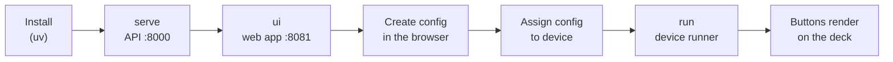

# Tutorial: from zero to a working deck

*Learning-oriented: one path, start to finish. Expect ~15 minutes. Everything
you build here works with **no Stream Deck hardware** — an emulated deck stands
in for the real thing.*

By the end you will have: the API running, the web UI open in a browser, a
config with a working button, that config assigned to a (virtual) device, and
the device runner rendering your buttons.



## Prerequisites

- **uv** (the Python tool manager). Check with `uv --version`; if it prints a
  version you're set. The stack also runs from a plain virtualenv — see
  [docs/dev.md](../../dev.md) for that path.
- Python **3.10+** (3.12 is what the repo targets).
- For this tutorial, **no** Stream Deck hardware and **no** frontend
  toolchain: the repo ships prebuilt frontend bundles (`frontend/dist/`,
  `frontend/dist-demo/`), and the API can emulate decks with
  `STREAMDECK_TRANSPORT=dummy`.

## Step 1 — Get the code

```sh
git clone https://github.com/Lewiscowles1986/streamdeck-monorepo
cd streamdeck-monorepo
```

Everything below assumes you are in this directory.

## Step 2 — Run the API

The one-command path uses `uvx` (uv's ephemeral tool runner) against the local
directory:

```sh
# With a real Stream Deck plugged in:
uvx . streamdeck serve

# Hardware-free (this tutorial):
STREAMDECK_TRANSPORT=dummy uvx . streamdeck serve
```

> Plugged-in hardware on **macOS** needs one extra dependency
> (`brew install hidapi`) before the deck will enumerate — see
> [Test a real Stream Deck](../how-to/real-hardware.md) for the full
> real-hardware path. This tutorial continues hardware-free.

You should see uvicorn boot and end with something like:

```text
INFO:     Uvicorn running on http://127.0.0.1:8000 (Press CTRL+C to quit)
INFO:     Application startup complete.
```

What just happened:

- `serve` starts the FastAPI app on port **8000** (options: `--host`, `--port`,
  `--reload` — full list in the [CLI reference](../reference/cli.md#streamdeck-serve)).
- On startup it creates the SQLite database (`streamdeck.db` in the current
  directory; change with the `STREAMDECK_DB` env var) and enumerates decks via
  the selected transport.
- With `STREAMDECK_TRANSPORT=dummy`, the emulated decks appear as devices with
  ids like `DUMMY0fd90060` — one per Elgato product id the library knows.

**Verify:** the API answers on `/devices`:

```sh
curl -s http://127.0.0.1:8000/devices
```

```json
[{"id":"DUMMY0fd90060","connected":true,"activeAgentId":null,
  "name":"Stream Deck Original - DUMMY0fd90060","currentConfigId":null,
  "type":"Stream Deck Original"}, ...]
```

Leave this terminal running.

## Step 3 — Open the web UI

In a **second terminal** (the API keeps running in the first):

```sh
uvx . streamdeck ui --port 8081
```

> `ui` serves the built frontend pointing at the API. `demo` (step 0 of the
> alternative path below) serves an offline demo build that needs no server
> at all. Both default to port **8080**; use whatever port is free with
> `--port`.

Open <http://127.0.0.1:8081> in a browser. The sidebar has four pages:
**Devices**, **Configurations**, **Agents**, **Settings**.

The UI needs to know where the API is. Its default is
`http://localhost:8000` — if you started the API on another port (or are
reading this with the API on 8765 in an example), point the UI at it:

1. Click **Settings** in the sidebar.
2. Enter the **API Base URL** (for this tutorial: `http://127.0.0.1:8000`).
3. Click **Save & Connect**.

The status pill flips to **Connected** and the footer shows a green icon.


**Verify:** the **Devices** page lists the dummy decks with green **Online**
badges and *Active Config* = "None assigned".

## Step 4 — Create a config in the web app

1. Click **Configurations** → **New config**.
2. Name it (the placeholder suggests *My gaming layout* — any name works) and
   pick the device type. The emulated decks report themselves as
   **Stream Deck Original** (a 5×3 grid); choose **Stream Deck (5×3)** so the
   editor grid matches, then click **Create**.

   > Device-type dialects: configs store kebab ids (`stream-deck-xl`) while
   > devices return human names ("Stream Deck Original"). The runner matches
   > case-insensitively with space→dash tolerance, so either spelling works —
   > see [the parity rules](../reference/parity.md#the-table-summarized).

3. You land in the **visual editor**: a grid of buttons mirroring the device
   layout, plus an editor panel with three tabs — **Idle**, **Pressed**,
   **Action**.
4. Click button **1**. In the **Idle** tab:
   - **Text**: type `PING`.
   - Optionally set Font Family/Size/Color/Position — the runner honors all
     four ([config schema](../reference/config-schema.md#buttonappearance)).
5. Open the **Action** tab, set **Action Type** → **Command**, and fill:
   - **Executable**: `/bin/echo`
   - **Arguments**: `hello from button {{button_index}}`

   `{{button_index}}` is a [template variable](../explanation/template-variables.md)
   — the agent expands it at press time. The Executable/Arguments fields also
   autocomplete: type `/bin/e` to see suggestions, and `{{` to complete
   template variables inline ([how-to](../how-to/completion.md)).
6. Click **Save** (top right) and wait for *Configuration saved
   successfully.*

**Verify what the wire looks like.** The editor's **JSON View** tab shows the
exact config the API stores and the runner will consume:

```json
{
  "name": "My layout",
  "deviceType": "stream-deck",
  "buttons": [
    {
      "index": 0,
      "idle": { "text": "PING" },
      "action": {
        "type": "command",
        "executable": "/bin/echo",
        "arguments": "hello from button {{button_index}}"
      }
    }
  ]
}
```

## Step 5 — Assign the config to the device

1. Go to **Devices**.
2. On an online device card, click **Assign**.
3. Pick your config from the dialog and confirm.

Behind the scenes this calls `PUT /device/{device_id}/config/{config_id}`;
the card's *Active Config* now links to your config.


**Verify:** from a terminal, the runner-facing endpoint returns the whole
config plus the device:

```sh
curl -s http://127.0.0.1:8000/device/DUMMY0fd90060/config
```

```json
{
  "config": { "id": "…", "name": "My layout", "buttons": [ … ] },
  "device": { "id": "DUMMY0fd90060", "currentConfigId": "…", … }
}
```

## Step 6 — Run the device runner

Third terminal (API and UI keep running):

```sh
uvx . streamdeck run
```

The runner:

- enumerates decks through the same transport selection as the API — run it
  with the same `STREAMDECK_TRANSPORT=dummy` env var you used for `serve`;
- skips decks whose type doesn't match the config's `deviceType` (override
  with `--ignore-device-type-check`; target one deck with `--device-id`);
- loads the assigned config from the API, renders every key at idle, and
  starts the 30 fps animation loop and the trigger watcher.

Console output looks like:

```text
Found 16 Stream Deck(s).
[API] Using assigned config 'My layout'
Opened 'Stream Deck Original' (DUMMY0fd90060)
[TRIGGER] automatic switching watcher started
```

**Verify:** with real hardware, the deck now shows `PING` on button 1; press
it and you'll see the key's pressed state plus the agent enqueue log. With
the dummy transport there is nothing physical to press — but the whole
pipeline above is exactly what the full-stack E2E suite exercises (a dummy
deck, a real API, a config assigned through the UI):

```ts
// Adapted from e2e/parity-fullstack.spec.ts
// ("device config assignment round-trips through the real API").
const devicesResponse = await page.request.get("http://localhost:8000/devices");
const devices = await devicesResponse.json();
const device = devices.find((d) => d.connected) ?? devices[0];

const assignResponse = await page.request.put(
  `http://localhost:8000/device/${device.id}/config/${configId}`
);
expect(assignResponse.ok()).toBeTruthy();

const assigned = await (await page.request.get(
  `http://localhost:8000/device/${device.id}/config`
)).json();
expect(assigned.config).toMatchObject({ id: configId, name: configName });
expect(assigned.device).toMatchObject({ id: device.id, currentConfigId: configId });
```

## What you learned

| Piece | What it does | Where to go deeper |
| --- | --- | --- |
| `streamdeck serve` | FastAPI + SQLite config store | [API reference](../reference/api.md) |
| `streamdeck ui` / `demo` | web app (full-stack / offline) | [Explanation: architecture](../explanation/architecture.md) |
| `streamdeck run` | renders keys, executes presses | [Explanation: animation pipeline](../explanation/animation-pipeline.md) |
| Device assignment | `PUT /device/{id}/config/{config_id}` | [How-to: switch configs](../how-to/switch-config-button.md) |

## Cleanup

`Ctrl+C` each terminal (`serve`, `ui`, `run`). The SQLite file
`streamdeck.db` keeps your config — delete it for a clean slate.

## Next steps

- Make the deck switch itself: [Automate with triggers](triggers.md).
- Put a real image on a button: [Upload an animated GIF](../how-to/animated-gif-button.md).
- Route presses to another computer: [Nominate agents](../how-to/nominate-agents.md).